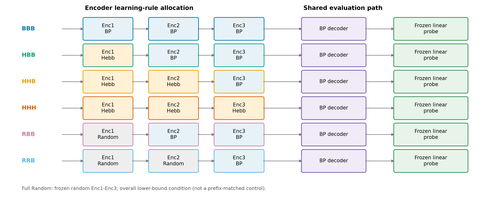
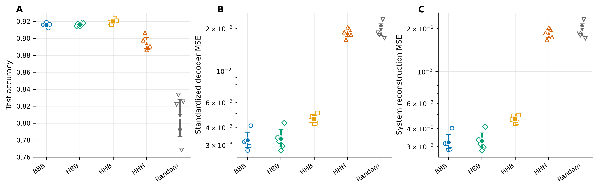
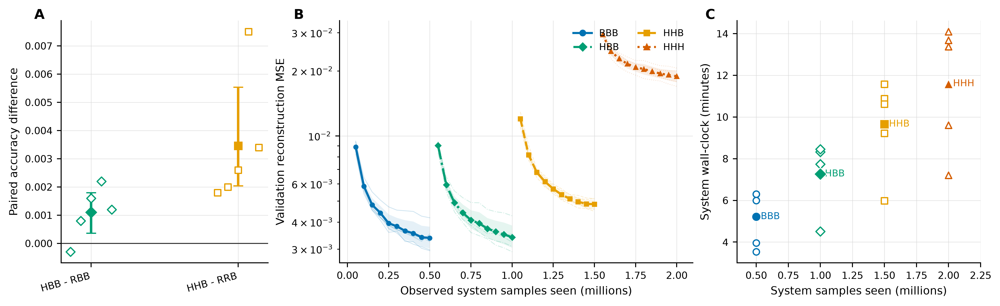
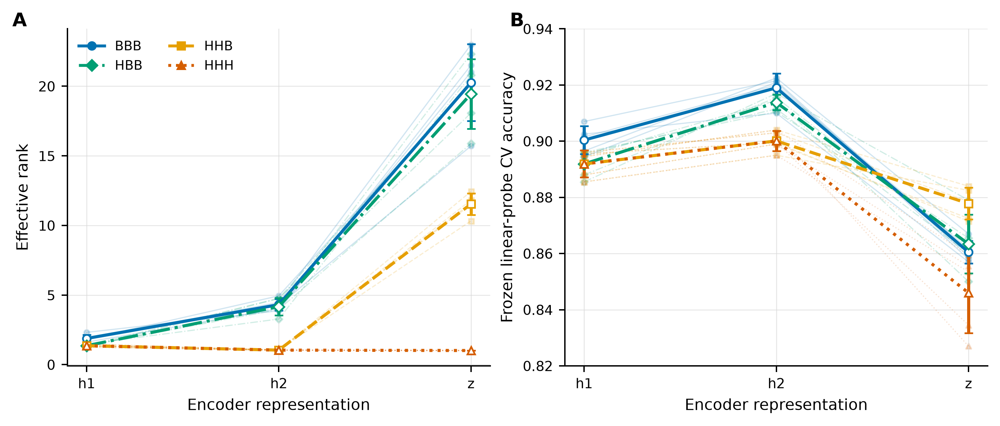
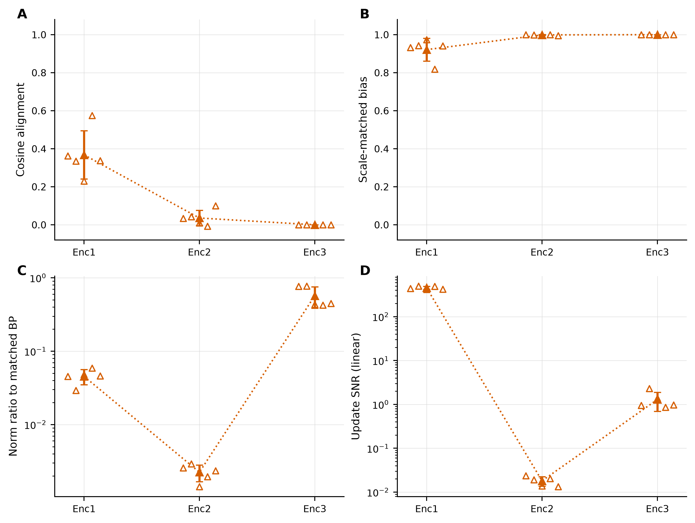
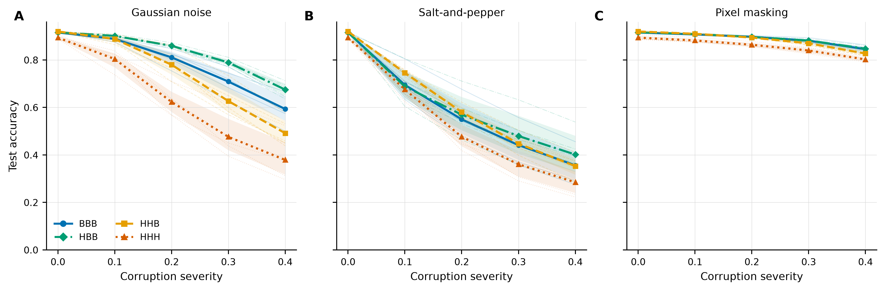
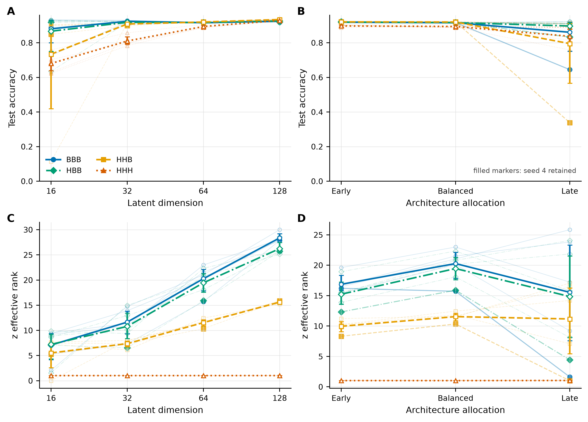

# Where Does Hebbian Learning Help?

## Layerwise Credit-Assignment Ablations in a Convolutional Autoencoder

*Comparing backpropagation, competitive Hebbian learning, and minimal hybrid credit assignment on MNIST*

## Abstract

Global backpropagation (BP) assigns credit across layers, whereas biologically motivated learning is often local. This study asks how far a local rule can be stacked through a hierarchical encoder before global credit assignment becomes necessary. We compare four learning-rule allocations in a three-layer convolutional autoencoder on MNIST: a full-BP encoder (BBB), a fully local competitive Oja/winner-take-all encoder (HHH), and two hybrid encoders that introduce BP at the third layer (HHB) or the second layer (HBB). Random-prefix controls isolate the incremental value of learned Hebbian prefixes. All formal comparisons use five paired seeds, a common BP decoder, a standardized decoder evaluation, and frozen linear probes.

HHH retains substantial classification information but compresses its deepest representation to an effective rank of 1.016 and reconstructs much more poorly than BBB. Introducing BP only at Enc3 raises the mean latent effective rank to 11.541 and improves classification, while introducing BP at Enc2 raises it to 19.450 and improves reconstruction and corruption robustness. Learned Hebbian prefixes provide small, reproducible classification gains over matched random prefixes, but not a corresponding standardized-reconstruction advantage. Mechanistically, Hebbian alignment with the matched BP reconstruction direction decreases from 0.368 at Enc1 to 0.0356 at Enc2 and approximately zero at Enc3. These results identify a depth-dependent credit-assignment boundary in this tested architecture and rule; they do not establish a general limitation of Hebbian learning.

## 1. Introduction

Modern deep learning usually trains multilayer systems with global BP credit assignment. A loss defined at the output is propagated through the network so that each layer receives an update related to the system objective. Biological learning mechanisms, by contrast, are commonly modeled through local interactions between pre- and postsynaptic activity. The scientific tension is therefore not only whether BP outperforms a local rule, but where the difference becomes consequential inside a hierarchy.

This study asks a more specific question: **How far can local Hebbian learning be stacked into a hierarchical encoder before global credit assignment becomes necessary?** We address it through a controlled allocation of learning rules across the three encoder layers of a convolutional autoencoder. BBB uses BP throughout the encoder; HHH uses a competitive Oja/WTA Hebbian rule throughout; HHB introduces BP only at the deepest encoder layer; and HBB introduces BP at the second layer. A shared decoder and common evaluation path make the location of global credit assignment the main intervention.

The contribution is threefold. First, the design separates shallow local feature learning from the consequences of stacking the same local objective at greater depth. Second, matched random-prefix controls distinguish the value of a learned Hebbian prefix from merely leaving the corresponding prefix untrained. Third, performance measures are interpreted alongside layerwise representation geometry, corruption robustness, and local-update comparisons. Together these analyses show that class information can remain decodable even when representation dimensionality and reconstruction quality are severely impaired.

The conclusions are deliberately narrow. They concern MNIST, one three-layer convolutional autoencoder, and one competitive Oja/WTA-style rule under the frozen protocol. They do not imply that Hebbian learning in general collapses or that BP is the only possible deep credit-assignment mechanism.

## 2. Research Questions

The final study is organized around six questions:

1. **Q1 — Performance:** How do full BP, full competitive Hebbian learning, and two hybrid depth allocations compare in frozen linear probe classification and reconstruction?
2. **Q2 — Representation:** At which layer does low-dimensional compression emerge, and where does BP restore effective dimensionality?
3. **Q3 — Robustness:** How do clean-trained representations behave under frozen Gaussian, salt-and-pepper, and masking corruptions?
4. **Q4 — Update mechanism:** How does the effective Hebbian update compare with the matched BP reconstruction direction as encoder depth increases?
5. **Q5 — Capacity:** Does changing nominal latent dimension alter performance or remove the full-Hebbian rank-collapse pattern?
6. **Q6 — Architecture:** Does reallocating channels across encoder depth alter the same pattern or the stability of hybrid repairs?

Q1 contains the primary paired method contrasts. The HBB–RBB and HHB–RRB comparisons are protocol-mandated secondary contrasts that quantify learned-prefix value. Q3 severity-wise comparisons are formal; whole-curve AUC summaries and Q4 cross-metric correlations remain exploratory. Q5 and Q6 test whether the central representation finding survives bounded capacity and architecture changes.

## 3. Methods

### 3.1 Model and learning-rule allocation

The task is MNIST reconstruction and downstream digit classification. The frozen split uses 50,000 training images, 10,000 validation images, and the 10,000-image official test set. Inputs are scaled to `[0, 1]`, and reconstruction uses pixel-mean mean-squared error (MSE).

The balanced encoder has three convolutional layers. Enc1 maps the input to 16 channels at 14×14, Enc2 maps to 32 channels at 7×7, and Enc3 maps to a 64-dimensional 1×1 latent vector. ReLU follows each encoder convolution. The common three-layer transposed-convolution decoder is trained by BP and ends with a sigmoid output. The encoder has no biases, batch normalization, dropout, or pooling; decoder biases are enabled.

**Method design.** BBB is the full-BP encoder. HHH is the full competitive Hebbian encoder. HHB and HBB are hybrid models: HHB uses Hebbian Enc1/Enc2 and BP Enc3, whereas HBB uses Hebbian Enc1 and BP Enc2/Enc3. RBB and RRB replace the learned Hebbian prefixes of HBB and HHB with depth-matched frozen random prefixes. Full Random freezes Enc1–Enc3 and is an overall lower-bound condition, not a prefix-matched control. Every method is evaluated with a BP decoder and frozen linear probe.

BP components use Adam with a learning rate of 0.003 for ten epochs under the frozen v1.1 standard. Hebbian layers are trained greedily for ten epochs per layer using an explicit local competitive Oja update, top-*k* winner-take-all competition with a 0.10 winner fraction, and per-filter L2 normalization. Target clamping is disabled. Because each Hebbian layer sees its own ten-epoch pass, total observed training exposure differs by method: 500,000 samples for BBB, 1,000,000 for HBB, 1,500,000 for HHB, and 2,000,000 for HHH. These are training-cost observations, not claims of sample efficiency.

### 3.2 Evaluation

The frozen linear probe standardizes training features and fits a linear classifier with SGD for 30 epochs, selecting by validation performance. System reconstruction uses each model's trained decoder. Standardized reconstruction freezes the encoder and trains a decoder from a paired initialization for ten epochs with Adam at 0.003, selecting minimum validation MSE. This controls decoder training while preserving the encoder as the object of comparison.

Representation analyses use a fixed, balanced 2,000-image subset of the official test set, with 200 examples per class, after the formal freeze. The principal geometry measure is effective rank. It measures how broadly variance is distributed across representation dimensions; it is not a direct measure of semantic information. Frozen linear probe and k-nearest-neighbor decoding provide complementary measures of accessible class information. Winner coverage and entropy are retained as activity summaries but are not treated as sufficient measures of representation quality.

Robustness evaluation applies Gaussian noise, salt-and-pepper noise, and pixel masking at severities from 0 to 0.4 to clean-trained models. Reconstruction remains targeted to the clean image. This is corruption robustness under a fixed evaluation protocol, not adversarial robustness or noisy training.

For the update analysis, accepted model snapshots are evaluated on the same 50 fixed training batches without optimizer steps. The effective Hebbian update is compared with the same-layer BP direction induced by the matched reconstruction objective and snapshot. Reported measures include cosine alignment, norm ratio, scale-matched bias, and update signal-to-noise ratio (SNR). The BP direction is a defined comparator, not a universally optimal direction.

### 3.3 Formal design and statistics

All formal method comparisons use the paired seeds `[0, 1, 2, 3, 4]`; the seed is the statistical unit. Confidence intervals use a nonparametric paired-seed bootstrap with 10,000 resamples, bootstrap seed 2026, and 95% coverage. Formal test evaluation occurred only after the applicable freeze and selection gates. The aggregation, release-freeze, figure, and narrative steps added no test access. This statement does not imply that the official test set was never accessed during the project.

The capacity sweep tests latent dimensions 16, 32, 64, and 128. The architecture sweep holds the latent dimension at 64 and compares early-heavy `[64, 28, 64]`, balanced `[16, 32, 64]`, and late-heavy `[4, 33, 64]` channel allocations, with encoder parameter counts matched within 1%. Matched random-prefix contrasts are defined only for the balanced, 64-dimensional configuration.

## 4. Results

### 4.1 Full Hebbian learning preserves classification information but reconstructs poorly

**Figure 1.** Held-out classification and reconstruction for the four core methods and Full Random. Panel A uses a zoomed accuracy axis (0.76–0.93); open points show all five formal seeds, and interval estimates should accompany any visual comparison. Panels B and C use logarithmic MSE axes.

HHH reaches mean frozen linear probe test accuracy 0.8941, well above the Full Random lower bound of 0.8080, showing that its representation retains substantial class information. It nevertheless has much larger reconstruction error: mean standardized decoder MSE is 0.018689 for HHH, compared with 0.003234 for BBB. System reconstruction MSE shows the same separation (0.018500 versus 0.003201).

The hybrid allocations separate classification repair from reconstruction repair. HHB achieves the highest mean classification accuracy, 0.91986, and improves on HHH by 0.02576 (95% CI 0.01664–0.03328). Its mean standardized decoder MSE falls to 0.004569, a paired improvement of 0.014120 relative to HHH. This is a large repair, but not a complete one: BBB remains better than HHB in standardized reconstruction by 0.001334 (95% CI 0.001132–0.001504). Moving BP one layer earlier produces HBB standardized MSE 0.003312, close to BBB, while its mean accuracy is 0.91638. Thus HHB is best understood as a minimal rank and classification repair, whereas earlier BP intervention better restores reconstruction.

### 4.2 Shallow Hebbian prefixes provide a small but reproducible incremental classification benefit over matched random prefixes

**Figure 2.** Panel A isolates learned-prefix value through paired random-prefix controls. Panels B and C use only frozen, directly observed training trajectories and cost records; no missing trajectory is interpolated.

The matched controls show a small incremental classification contribution from learned Hebbian prefixes. HBB exceeds RBB by 0.00110 in mean accuracy (95% CI 0.00036–0.00180), and HHB exceeds RRB by 0.00346 (95% CI 0.00204–0.00554). These protocol-mandated secondary contrasts are reproducible across the five paired seeds, but their magnitude is modest. Neither contrast establishes a standardized-reconstruction advantage: the corresponding mean MSE differences are approximately +0.000010 and their confidence intervals include zero.

The training-cost panels provide context rather than an efficiency ranking. The mean observed wall-clock times are approximately 313 seconds for BBB, 436 for HBB, 579 for HHB, and 695 for HHH, with the samples-seen totals described above. The plotted learning curves comprise all 200 directly observed core-method trajectory points selected from the complete 350-row frozen audit table. Because schedules and objectives differ across methods, these curves document optimization history and resource cost; they do not show that one method is intrinsically more sample-efficient.

### 4.3 Deep Hebbian learning produces severe representation compression

**Figure 3.** Layerwise effective rank and frozen linear probe accuracy expose where representation geometry changes under each learning-rule allocation.

The central result is a depth-dependent divergence in representation geometry. HHH effective rank decreases from 1.361 at h1 to 1.045 at h2 and 1.016 at z. The fully local stack therefore approaches a one-dimensional latent representation. This compression is severe despite an HHH z-layer frozen linear probe cross-validation accuracy of 0.8460. Effective dimensionality and accessible class information are related but distinct properties.

HHB shares HHH's accepted Hebbian prefix, so its h1 and h2 statistics are identical. BP at Enc3 then raises mean z effective rank to 11.541, a paired increase of 10.525 over HHH (95% CI 9.845–11.075). Its z frozen linear probe accuracy also increases by 0.0318 (95% CI 0.0224–0.0428). Layerwise CKA between HHH and HHB is 1.0 at h1 and h2 and falls to 0.672 at z, localizing the representation change to the BP-trained third encoder layer.

HBB intervenes earlier. Its h2 effective rank rises to 4.171 and its z rank to 19.450, close to BBB's 4.310 and 20.269. The mean z-to-h2 effective-rank ratio is 11.048 for HHB, compared with 4.767 for HBB and 4.741 for BBB, reflecting strong compensation at the layer where BP is introduced. HBB has higher rank than HHB but slightly lower z frozen linear probe accuracy (0.8634 versus 0.8778). This reversal reinforces that effective rank cannot be equated with semantic information.

### 4.4 Hebbian update alignment with the matched BP reconstruction direction deteriorates with depth

**Figure 4.** The canonical HHH local updates are compared with the matched BP reconstruction direction at the same snapshots and batches.

At Enc1, the effective Hebbian update has a measurable component aligned with the matched BP direction: mean cosine alignment is 0.3680, and the linear update SNR is 453.1. At Enc2, alignment falls to 0.03563, norm ratio to 0.002242, and SNR to 0.0181 (−17.54 dB), while scale-matched bias reaches 0.9987. At Enc3, mean alignment is approximately zero (0.0000459), with scale-matched bias effectively one. Per-filter normalization changes update scale but not this directional comparison.

The depth trend is consistent with the layerwise geometry in Figure 3: the shallow local update retains a component related to the reconstruction direction, while the deeper local updates are nearly unaligned where compression is most severe. This is a mechanistic association under one comparator and objective, not strict causal proof. It neither establishes that the matched BP direction is universally optimal nor excludes other local rules that could provide useful deep credit assignment.

### 4.5 Earlier BP intervention improves corruption robustness

**Figure 5.** Clean-trained classifiers evaluated under Gaussian, salt-and-pepper, and masking corruptions. Severity-wise summaries are formal; aggregate AUC contrasts are supplementary.

At severity 0.4, HBB has the highest mean accuracy for all three corruption families: 0.6752 under Gaussian noise, 0.4016 under salt-and-pepper noise, and 0.8475 under masking. HHB reaches 0.4917, 0.3530, and 0.8271, respectively. Relative to HHB, HBB loses less accuracy from clean to severity 0.4 under Gaussian noise by 0.1870 (95% CI 0.1180–0.2487) and under masking by 0.0239 (95% CI 0.0090–0.0373). The corresponding salt-and-pepper degradation contrast is 0.0520 but its interval includes zero.

HHB's strong clean accuracy therefore does not imply equally strong corruption robustness. HHH also illustrates why representational cosine stability is insufficient: its noisy z representations maintain cosine values near one while its noisy classification is generally weakest or near weakest. A nearly fixed direction is expected from a rank-collapsed representation and is not evidence of preserved semantic content.

### 4.6 Capacity and architecture modify performance without removing the full-Hebbian rank-collapse pattern

**Figure 6.** Accuracy and z effective rank across the frozen dimension and architecture sweeps. All formal seeds are retained, including unusual late-heavy seed 4 outcomes.

Increasing nominal latent dimension can improve HHH classification without repairing its geometry. HHH mean accuracy rises from 0.6801 at dimension 16 to 0.9290 at dimension 128, while mean z effective rank remains approximately one (1.01–1.02). Nominal capacity is therefore not equivalent to effective dimensionality. The method-by-dimension interaction for accuracy is not significant (*p*=0.2629), whereas the corresponding interaction for z effective rank is strong (*p*=1.39×10⁻¹⁶). This distinction prevents the representation result from being recast as a general significant performance interaction.

Channel allocation changes variability but does not remove the HHH pattern. Across early-heavy, balanced, and late-heavy encoders, HHH mean z effective rank remains near one. The late-heavy configuration is unstable for several methods. In retained seed 4, accuracies are 0.6446 for BBB, 0.8898 for HHH, 0.3380 for HHB, and 0.8330 for HBB. Across architectures, HBB has the smallest descriptive accuracy sensitivity (0.024), while HHB has the largest (0.137). These are descriptive stability observations: the overall method-by-architecture accuracy interaction is not significant (*p*=0.8169). They support caution about the variability of late BP intervention, not a global statistical claim that one hybrid is architecture-invariant.

## 5. Discussion

The experiments locate a boundary rather than declare a winner between learning paradigms. The shallow competitive Oja/WTA layer is useful: HBB's learned first-layer prefix produces a small but reproducible accuracy advantage over its random-prefix control, and Enc1's local update contains a measurable component aligned with the matched reconstruction direction. Local feature learning is therefore not merely tolerated by the system; under this protocol it contributes incremental class information.

The outcome changes when the same local mechanism is stacked. HHH preserves surprisingly high digit classification while its h2 and z representations approach rank one. This combination matters because classification alone would make HHH look only modestly worse than the hybrids. Reconstruction and geometry reveal a much larger deficit. A low-dimensional direction can still order examples in a way that supports class separation, so frozen linear probe performance cannot by itself certify a healthy, information-rich hierarchy.

BP repairs geometry at the layer where it is introduced. HHB leaves the low-rank Hebbian h2 unchanged but expands z and improves its decodability. HBB repairs h2 first and arrives at a z rank close to BBB. The compensation ratios show that a deep BP layer can transform a compressed input into a broader output representation, but the incomplete reconstruction repair in HHB shows that this compensation does not recover every property lost upstream. Earlier BP access provides the more consistent reconstruction and corruption-robustness profile.

The update analysis offers a compatible mechanism. Enc1 Hebbian updates have a visible aligned component with the matched reconstruction direction; Enc2 alignment and SNR are very low; Enc3 is approximately orthogonal. This depth trend corresponds to, but does not by itself cause, the rank pattern. The comparison is objective-specific and cannot establish that BP is biologically privileged or universally optimal.

Two measurement lessons follow. First, representation rank and semantic information must be reported separately: HHB and HBB reverse order depending on whether rank or z-layer linear decoding is considered. Second, winner diversity is inadequate as a representation-health criterion. Earlier repair attempts could broaden winner usage without reliably restoring effective rank or downstream performance. The combined use of reconstruction, effective rank, and frozen decoding gives a more informative account.

Finally, the three-layer encoder serves as a controlled depth-allocation framework. BBB, HBB, HHB, and HHH differ in where global credit assignment begins, while the shared decoder and paired evaluation reduce unrelated variation. Within this framework, the evidence supports a practical statement: the tested local rule remains useful at shallow depth, but deeper stacking requires another source of credit assignment to preserve representation geometry and broader system function.

## 6. Protocol History and Negative Results

Representation-health checks first identified a formal failure in the fully Hebbian encoder: the accepted seed-42 run had z effective rank 1.0186 and only seven fixed winners, despite 90.4% frozen linear probe accuracy. Eight preregistered repair candidates did not pass the joint health criteria. Some increased winner diversity, and input centering raised z effective rank to roughly 4.3, but no candidate simultaneously repaired the required representation and performance outcomes. This negative result motivated a layer-localization diagnostic rather than replacement of the unusual run.

The Stage 2C diagnostic showed that BP at Enc3 repaired z rank and that BP at Enc2 repaired both h2 and z rank. Stage 2D then evaluated HHB under a preregistered validation-only confirmation protocol on seeds 43 and 44. Its exact outcome was **CONFIRMATION FAILED** because seed 43 exceeded the standardized decoder reconstruction threshold: HHB/BBB MSE ratio 1.5688 versus the required maximum of 1.25. Both seeds supported classification stability and z-rank repair, but the failed reconstruction gate was not relaxed, no third seed was added, and Stage 2D was not converted to a pass.

Stage 3 was approved later as an independently documented post-confirmation re-scoping. It retained HHB as a rank-repair and minimal-credit-assignment condition while treating standardized reconstruction as an outcome rather than an eligibility assumption. The formal Stage 3 seeds are `[0, 1, 2, 3, 4]`; Stage 2D seeds 43 and 44 are confirmation evidence, not part of the final paired formal matrix.

## 7. Limitations

- The dataset is MNIST; the findings may not transfer to more complex visual distributions.
- The local mechanism is one competitive Oja/WTA-style Hebbian rule. Other local objectives, competition schemes, or modulatory signals may behave differently.
- The architecture is a three-layer convolutional autoencoder with a shared BP decoder. Greater depth or other objectives could move the observed boundary.
- Formal inference uses five paired seeds. The bootstrap intervals describe this paired design and do not substitute for a larger independent sample.
- The latent-dimension and channel-allocation sweeps are deliberately limited. Matched random-prefix evidence is available only for the balanced 64-dimensional case.
- Corruption tests are not adversarial robustness tests. They evaluate clean-trained models under frozen noisy inputs and do not study noisy training.
- Q4 establishes association between local-update geometry and representation outcomes; it is not direct causal identification.
- Effective rank, winner diversity, and frozen linear probe accuracy each capture different properties. None is sufficient alone.
- No conclusion here applies to Hebbian learning universally or establishes biological equivalence between the tested rule and neural plasticity.

## 8. Conclusion

Under the tested three-layer convolutional autoencoder and competitive Oja/WTA protocol, local Hebbian learning remains useful as a shallow feature-learning mechanism but becomes increasingly mismatched to the system reconstruction objective when stacked deeper. The fully local encoder retains class information while compressing its deepest representation to nearly one effective dimension. BP at Enc3 repairs latent dimensionality and classification; BP from Enc2 more fully restores reconstruction and robustness and is descriptively more stable across the tested architectures. The resulting boundary is specific rather than universal: it identifies where global credit assignment becomes necessary in this controlled system, while preserving the useful contribution of shallow local learning.

For exact tables, confidence intervals, and evidence roles, see [RESULTS_SUMMARY.md](RESULTS_SUMMARY.md), the [final figure captions](docs/final/FIGURE_CAPTIONS.md), and the [compact frozen release evidence](release/v1.0-final/).
